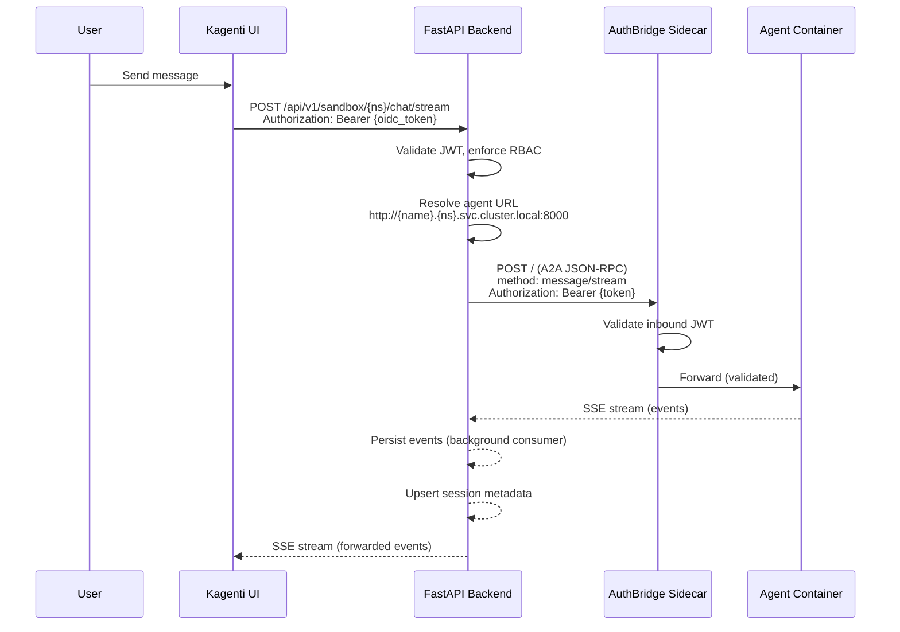
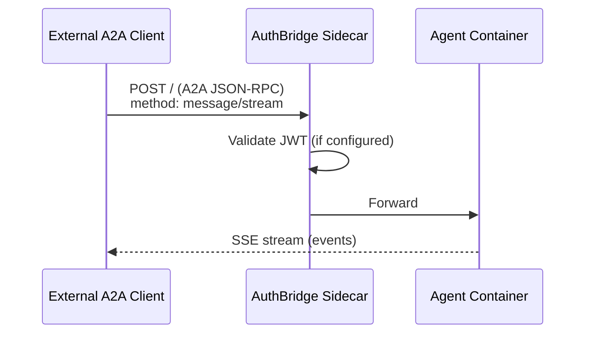
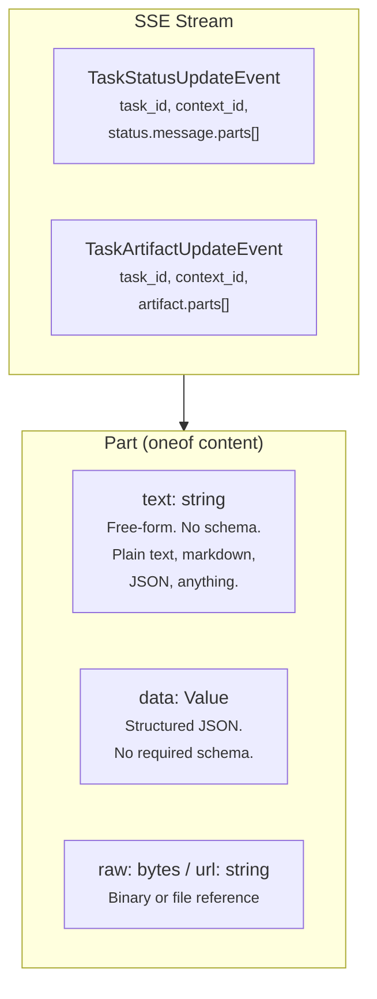
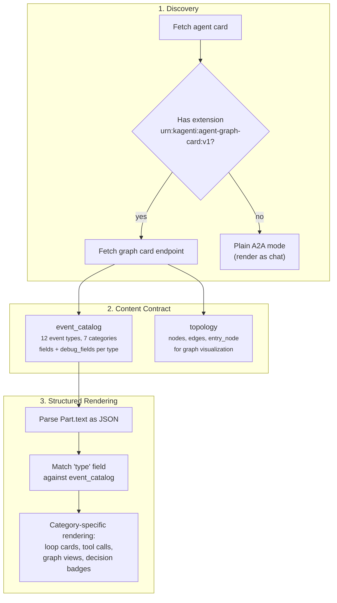

# A2A Protocol Integration

The Agentic Runtime uses the [A2A (Agent-to-Agent) protocol](https://google.github.io/A2A/)
as its composability boundary. This document covers how agents communicate,
the two access models (proxied vs direct), and our A2A extensions.

> **A2A SDK:** `a2a-sdk >= 0.2.5` (server-side). Spec: v1.0.0 (2026-03-12).
> We use the SDK on agents only; the backend uses raw JSON-RPC via httpx.
> See [detailed design](../plans/2026-03-17-a2a-integration-design.md) for
> SDK upgrade analysis and extension design.

---

## Communication Models

Agents are A2A-compliant HTTP services. There are two ways to reach them:

### Model 1: Proxied via Backend (Default)



**What you get:**
- Keycloak JWT validation + RBAC enforcement (`ROLE_OPERATOR`)
- Session persistence (PostgreSQL `sessions` + `events` tables)
- Background event consumer (survives UI disconnect)
- Gap-fill reconnect (events table)
- Session history aggregation
- Sidecar agent fan-out
- Agent card caching and discovery
- Feature flag gating
- File browser (pods/exec)
- Budget tracking UI integration

### Model 2: Direct A2A Access



An external system can call the agent directly using standard A2A protocol,
bypassing the Kagenti backend entirely. This requires network access to the
agent's Kubernetes Service.

**Direct access URL:**
```
http://{agent-name}.{namespace}.svc.cluster.local:8000
```

**What you get:**
- Pure A2A protocol compliance
- Framework-neutral agent invocation
- AuthBridge JWT validation (if sidecar injected)
- Istio Ambient mTLS encryption
- Agent's own task store (in-memory or PostgreSQL)
- Full SSE event stream with EVENT_CATALOG events
- AgentGraphCard at `/.well-known/agent-graph-card.json`
- Agent card at `/.well-known/agent-card.json`

**What you lose:**
- No session persistence in Kagenti's `sessions`/`events` tables
- No RBAC enforcement (backend `ROLE_OPERATOR` check)
- No background event consumer (events lost on disconnect)
- No gap-fill reconnect
- No sidecar agent observation
- No file browser
- No budget tracking UI
- No feature flag gating

### When to Use Each Model

| Use Case | Model | Why |
|----------|-------|-----|
| Kagenti UI user | Proxied | Full platform features, session history, budget UI |
| External A2A client (another agent) | Direct | Standard A2A interop, client manages own state |
| CI/CD pipeline calling agent | Direct | Lightweight, no UI needed, script-friendly |
| Multi-platform agent mesh | Direct | Each platform manages own RBAC and budget |
| Agent-to-agent delegation | Direct | `delegate` tool calls peer agents via A2A |
| Custom dashboard / external UI | Either | Proxied if you want Kagenti sessions, direct for custom state |

---

## A2A Protocol Details

### JSON-RPC Request Format

```json
{
  "jsonrpc": "2.0",
  "id": "request-uuid",
  "method": "message/stream",
  "params": {
    "message": {
      "role": "user",
      "parts": [{"kind": "text", "text": "Analyze this codebase"}],
      "messageId": "msg-uuid",
      "contextId": "session-uuid"
    }
  }
}
```

| Field | Purpose |
|-------|---------|
| `method` | `message/stream` for streaming, `message/send` for non-streaming |
| `contextId` | Groups multiple tasks into a session (A2A core spec, not extension) |
| `messageId` | Unique per message |
| `parts` | Content parts (text, file, data) |

### SSE Response Events

The agent streams A2A events plus our EVENT_CATALOG events:

```
data: {"result":{"id":"task-uuid","contextId":"session-uuid","status":{"state":"working"}}}

data: {"result":{"status":{"state":"working","message":{"parts":[{"kind":"text","text":"{\"type\":\"planner_output\",...}"}]}}}}

data: {"result":{"status":{"state":"completed"}}}

data: [DONE]
```

A2A task lifecycle states:

| State | Meaning |
|-------|---------|
| `submitted` | Task acknowledged |
| `working` | Being processed |
| `completed` | Finished successfully |
| `failed` | Finished with error |
| `input-required` | Needs user input (HITL) |

### Agent Discovery

Agents expose `/.well-known/agent-card.json` per the A2A spec:

```json
{
  "name": "sandbox-legion",
  "description": "LangGraph coding agent with persistent sessions",
  "version": "1.0.0",
  "url": "http://sandbox-legion.team1.svc.cluster.local:8000",
  "capabilities": {
    "streaming": true,
    "extensions": [
      {
        "uri": "urn:kagenti:agent-graph-card:v1",
        "description": "Processing graph topology and event schemas",
        "required": false,
        "params": {"endpoint": "/.well-known/agent-graph-card.json"}
      }
    ]
  },
  "skills": [
    {
      "id": "coding",
      "name": "Coding Agent",
      "description": "Plan-execute-reflect coding with shell, file, and web tools"
    }
  ]
}
```

The backend discovers agents by fetching this endpoint. It tries port 8080
first (AuthBridge sidecar), falls back to 8000 (direct).

---

## The Content Format Gap

A2A defines **how agents communicate** (JSON-RPC, SSE, task lifecycle) but
is **intentionally agnostic about what they say**. This is both a strength
and a gap that AgentGraphCard fills.

### What A2A Prescribes

A2A streaming sends two event types carrying `Part` content:



The `Part.text` field is a free-form string. A2A says nothing about what
goes inside. There is **no type discriminator, no schema, no content
contract**. The optional `media_type` is a hint, not enforced.

### The Problem

A client receiving a `Part.text` has no way to know what it contains:

```mermaid
flowchart LR
    subgraph agents["Two Different Agents"]
        OurAgent["Instrumented Agent<br/><small>Sends: {\"type\":\"tool_call\",<br/>\"name\":\"shell\",\"args\":\"ls\"}</small>"]
        ExtAgent["External Agent<br/><small>Sends: I found 3 issues<br/>in the codebase...</small>"]
    end

    subgraph client["Client Receives Part.text"]
        Q{"Is this JSON?<br/>What schema?<br/>How to render?"}
    end

    OurAgent --> Q
    ExtAgent --> Q
    Q --> Problem["Without prior knowledge<br/>of the agent's event format,<br/>the client can only show raw text"]
```

A2A provides the **transport** but not the **content contract**. The client
must already know the agent's event schema to render structured reasoning
(tool calls, plan steps, reflector decisions, graph views).

### How AgentGraphCard Fills the Gap



The graph card is a **self-describing content contract** that tells clients:
- What event types exist (`event_catalog` with 12 types)
- What category each belongs to (reasoning, execution, tool_output, decision, terminal, meta, interaction)
- What fields each event has (with types and descriptions)
- How the agent's processing graph looks (`topology` with nodes + edges)
- Which common fields appear on every event (type, loop_id, event_index, node_visit, model, tokens)

Without the graph card, a client can only show raw text. With it, a client
can render rich UI: graph views, loop cards, tool call panels, budget tracking.

### Two-Tier Rendering

This creates a natural two-tier model for any A2A client:

| Agent Type | Detection | Rendering |
|-----------|-----------|-----------|
| **Instrumented** (has graph card) | `urn:kagenti:agent-graph-card:v1` in agent card extensions | Graph views, loop cards, step rendering, topology DAG |
| **Plain A2A** (no graph card) | Extension absent | Chat bubbles with status badges |

Both types get: sessions, task lifecycle, multi-turn via `context_id`.
Instrumented agents additionally get: structured event rendering, graph
visualization, event persistence with categories.

---

## Event Data Format — TextPart vs DataPart

### Current: JSON Strings in TextPart (v0)

Today, EVENT_CATALOG events are serialized as NDJSON strings and wrapped in
`TextPart`. This means structured data is **double-encoded** (JSON inside JSON):

```json
{"parts": [{"kind": "text", "text": "{\"type\":\"tool_call\",\"name\":\"shell\"}"}]}
```

The backend must split by `\n`, `json.loads()` each line, and check for
`loop_id` to distinguish events from plain text. This is fragile and adds
~30% wire overhead from JSON escaping.

### Planned: Structured DataPart (v1)

A2A SDK has `DataPart(data=dict)` — a native structured JSON container.
Each event becomes a separate Part with no string encoding:

```json
{"parts": [
  {"kind": "data", "data": {"type": "tool_call", "name": "shell", "event_index": 5}},
  {"kind": "data", "data": {"type": "tool_result", "name": "shell", "output": "..."}},
  {"kind": "text", "text": "Executed shell command ls -la"}
]}
```

**DataParts** carry structured events for instrumented clients.
**TextPart** carries a human-readable summary for plain A2A clients.
Both in the same message — backward compatible.

| Approach | Wire Size | Parsing | Type Safety |
|----------|----------|---------|-------------|
| TextPart + NDJSON (current) | ~3KB/event | Manual split + json.loads | None |
| DataPart (planned) | ~2KB/event | `get_data_parts()` from SDK | `kind == "data"` discriminator |
| Protobuf via gRPC (future) | ~400B/event | Generated stubs | Compile-time from .proto |

### Transport: SSE vs gRPC

A2A v1.0 supports both JSON-RPC/SSE and gRPC/protobuf. We use SSE today.

| Dimension | SSE (current) | gRPC (future option) |
|-----------|--------------|---------------------|
| Browser support | Native (`fetch`) | Needs grpc-web proxy or Connect |
| Wire size | ~2-5KB/event (JSON) | ~400B/event (protobuf binary) |
| Debugging | Easy (curl, dev tools) | Harder (grpcurl, binary) |
| Schema | None (runtime) | Compile-time from .proto |
| Infrastructure | Nothing extra | Envoy or Connect runtime |
| React support | Native | `@connectrpc/connect-web` (mature) |

**Recommendation:** Switch to DataPart now (small change, 33% savings).
Define protobuf schema for EVENT_CATALOG (type safety from .proto).
Evaluate gRPC only when session history transfer exceeds ~1000 events.

See [detailed design](../plans/2026-03-17-a2a-integration-design.md#7-textpart-vs-datapart--should-we-switch)
for migration code examples and protobuf schema design.

---

## A2A Extensions

### Registered Extensions

| Extension | URI | Status | Purpose |
|-----------|-----|--------|---------|
| **AgentGraphCard** | `urn:kagenti:agent-graph-card:v1` | Shipped | Graph topology + event catalog |
| **Session metadata** | -- | Planned | Session persistence, budget, ownership |

### AgentGraphCard Extension

Our primary A2A extension. Agents declare it in their `AgentCard.capabilities.extensions[]`
and expose the endpoint at `/.well-known/agent-graph-card.json`.

```
URI: urn:kagenti:agent-graph-card:v1
Endpoint: /.well-known/agent-graph-card.json
Required: false
```

The graph card contains:
- **event_catalog** -- every event type the agent can emit, with categories and fields
- **topology** -- the agent's processing graph (nodes, edges, entry_node)
- **common_event_fields** -- fields present on every streamed event

This enables framework-neutral UI rendering. See [Concepts](./concepts.md#agentgraphcard).

### Session Context Extension (Planned)

A2A v1.0 has `context_id` as a core field (not an extension) for grouping
tasks into sessions. However, session **metadata** (owner, budget limits,
model override, title) is Kagenti-specific.

Planned extension to expose session metadata via A2A:

```
URI: urn:kagenti:session-metadata:v1 (planned)
Purpose: Session persistence, ownership, budget limits
Storage: Message.metadata["urn:kagenti:session-metadata:v1/session"]
```

This would allow direct A2A clients to read/write session metadata without
going through the Kagenti backend.

---

## SDK Version Analysis

| Component | Version | Notes |
|-----------|---------|-------|
| A2A Spec | v1.0.0 (2026-03-12) | Major rewrite from v0.3 |
| a2a-sdk (PyPI) | 0.3.25 stable / 1.0.0a0 alpha | We use `>=0.2.5` |
| Our pinned | `>=0.2.0` (backend), `>=0.2.5` (tests) | Pre-v1.0 API |

**SDK v0.2 vs v1.0 breaking changes:**
- Enum values: `"completed"` -> `"TASK_STATE_COMPLETED"`
- Part types: separate `TextPart`/`FilePart` -> unified `Part` with `oneof`
- Agent card: restructured `capabilities` and `supportedInterfaces`
- Proto package: `a2a.v1` -> `lf.a2a.v1`

**Upgrade path:** The `1.0.0a0` alpha SDK is available. Upgrade requires
updating all A2A type imports and enum references. See
[detailed design](../plans/2026-03-17-a2a-integration-design.md) for
the migration plan.

---

## Port Discovery

| Port | Used By | When |
|------|---------|------|
| 8080 | AuthBridge sidecar (Envoy) | Agents with `kagenti.io/inject: enabled` |
| 8000 | Direct agent container | Sandbox agents, platform base agents |

The backend tries 8080 first, falls back to 8000 on connection error.
Direct A2A clients should use the agent's Kubernetes Service, which maps
to the correct port.
