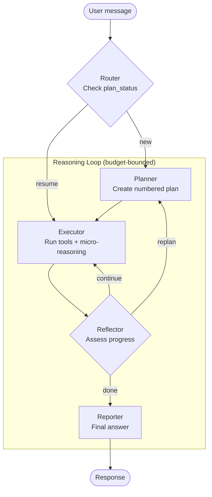

# Concepts

This document explains the core concepts of the Kagenti Agentic Runtime.

---

## Sessions

A **session** is a multi-turn conversation between a user and a sandbox agent.
Each session has a unique `context_id` (UUID) that persists across messages
within the same conversation.

- Sessions are stored in a per-namespace PostgreSQL database
- Each message within a session creates an A2A **task** (submitted -> working -> completed/failed)
- The UI groups tasks by `context_id` to show conversation history
- Sessions track metadata: agent name, owner, model override, budget limits

## Sandbox Agents

A **sandbox agent** is an AI coding agent running in a Kubernetes pod with
the platform's security and infrastructure layers. The agent receives user
messages via the A2A protocol, reasons about the task, executes tools, and
streams results back.

Agents are deployed per-namespace (e.g. `team1`) with their own:
- PostgreSQL database (sessions + LLM budget tracking)
- Egress proxy (Squid domain allowlist)
- LLM Budget Proxy (token enforcement)
- Workspace volume (per-session file isolation)

## Reasoning Loop

The reference sandbox agent (LangGraph) uses a **plan-execute-reflect** loop
with 5 nodes:

1. **Router** checks `plan_status` to decide: start fresh or resume existing plan
2. **Planner** decomposes the user request into numbered steps
3. **Executor** runs plan steps with bound tools (shell, file_read, file_write, web_fetch, explore, delegate). After each tool call, **micro-reasoning** interprets the result before deciding the next action
4. **Reflector** evaluates progress and decides: continue, replan, done, or request HITL approval
5. **Reporter** synthesizes the final answer for the user

Budget enforcement happens at every node via the LLM Budget Proxy (HTTP 402
on exceed).

## Event Pipeline

The event pipeline streams reasoning loop events from agent to UI in real-time
and persists them for historical reconstruction.

**Six-stage flow:**

1. **Agent emits events** -- typed JSON events (planner_output, tool_call,
   tool_result, reflector_decision, reporter_output, etc.) with monotonic
   `event_index` and `langgraph_node` annotations
2. **AgentGraphCard** -- agent exposes `/.well-known/agent-graph-card.json`
   describing its event catalog and graph topology
3. **SSE forwarding** -- backend proxies events to the UI via Server-Sent Events
4. **Background consumer** -- standalone `asyncio.Task` persists every event
   to the `events` table, independent of UI connection
5. **Historical reconstruction** -- on session load, UI reconstructs from
   events table (preferred), loop_events blob (fallback), or raw history
6. **Gap-fill reconnect** -- on SSE disconnect, UI fetches missed events
   from `GET /events?from_index=N` before resubscribing

### Event Categories

Events are organized into 7 categories:

| Category | Event Types | UI Rendering |
|----------|------------|-------------|
| **reasoning** | planner_output, thinking, micro_reasoning, executor_step | Plan steps, thinking blocks |
| **execution** | tool_call | Tool call cards |
| **tool_output** | tool_result | Tool result display |
| **decision** | reflector_decision, router_decision | Decision badges |
| **terminal** | reporter_output, error | Final answer, error |
| **meta** | budget_update, node_transition | Hidden from steps, used for graph counters |
| **interaction** | hitl_request | HITL approval buttons |

## AgentGraphCard

The **AgentGraphCard** is a self-describing manifest exposed at
`/.well-known/agent-graph-card.json`. It has two layers:

1. **Event Catalog** -- every event type the agent can emit, with categories,
   fields, and debug fields. The UI uses this to know what to render.
2. **Topology** -- the agent's processing graph (nodes and edges). The UI
   uses this to render the Topology Graph View without hardcoded knowledge
   of the agent's structure.

This enables framework-neutral graph visualization -- as long as an agent
exposes a graph card, the UI can render its graph regardless of whether
it's LangGraph, OpenCode, CrewAI, or any other framework.

See [Writing Agents](./agents.md) for how to implement a graph card.

## Feature Flags

The Agentic Runtime is gated behind three feature flags:

| Flag | What It Gates |
|------|--------------|
| `KAGENTI_FEATURE_FLAG_SANDBOX` | All sandbox routes, sessions, sidecars, RBAC, deploy API |
| `KAGENTI_FEATURE_FLAG_INTEGRATIONS` | Integrations page |
| `KAGENTI_FEATURE_FLAG_TRIGGERS` | Trigger management (cron, webhook, alert) |

When disabled (default), the backend doesn't register sandbox routes and the
UI hides sandbox pages. Zero footprint on the platform.

See [Configuration](./configuration.md) for details.

## LLM Budget Enforcement

Token budgets prevent runaway consumption. A **per-namespace LLM Budget Proxy**
intercepts all LLM calls between the agent and LiteLLM:

- **Within budget**: forwards request to LiteLLM, records usage
- **Exceeded**: returns HTTP 402 with structured error; agent gracefully stops

Three enforcement scopes: per-session (default 1M tokens), per-agent daily
(5M), per-agent monthly (50M).

See [Deployment](./deployment.md) for budget proxy setup.

## Human-in-the-Loop (HITL)

HITL gates allow users to approve or deny dangerous operations before the
agent executes them. When a tool requires approval:

1. Agent emits `hitl_request` event with tool name, args, and risk level
2. UI renders Approve/Deny buttons in the chat
3. User clicks Approve or Deny
4. Agent resumes with approval (executes tool) or denial (reflector replans)

## Sidecar Agents

Sidecar agents run alongside the primary sandbox agent and observe its
behavior without modifying the agent code:

- **Looper** -- auto-continue when agent pauses mid-task (partial)
- **Hallucination Observer** -- monitor for hallucinated paths/APIs (designed)
- **Context Guardian** -- track context window usage (designed)

Sidecars subscribe to the same SSE event stream as the UI and can trigger
HITL requests or inject messages.

## Composable Security

Security layers are composable -- operators toggle individual layers per agent:

| Layer | Mechanism | Always On? |
|-------|-----------|-----------|
| L1 | Keycloak OIDC authentication | Yes |
| L2 | Kubernetes RBAC per namespace | Yes |
| L3 | Istio Ambient mTLS | Yes |
| L4 | SecurityContext (non-root, drop ALL) | Toggle |
| L5 | NetworkPolicy (default-deny) | Toggle |
| L6 | Landlock filesystem isolation | Toggle |
| L7 | Egress proxy (Squid allowlist) | Toggle |
| L8 | HITL approval gates | Yes |

Named profiles combine layers for common use cases: `legion` (dev),
`basic` (trusted), `hardened` (production), `restricted` (third-party).

See [Security](./security.md) for details.
