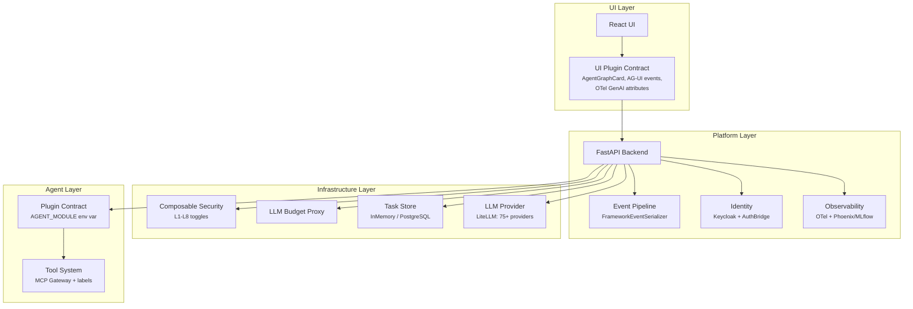
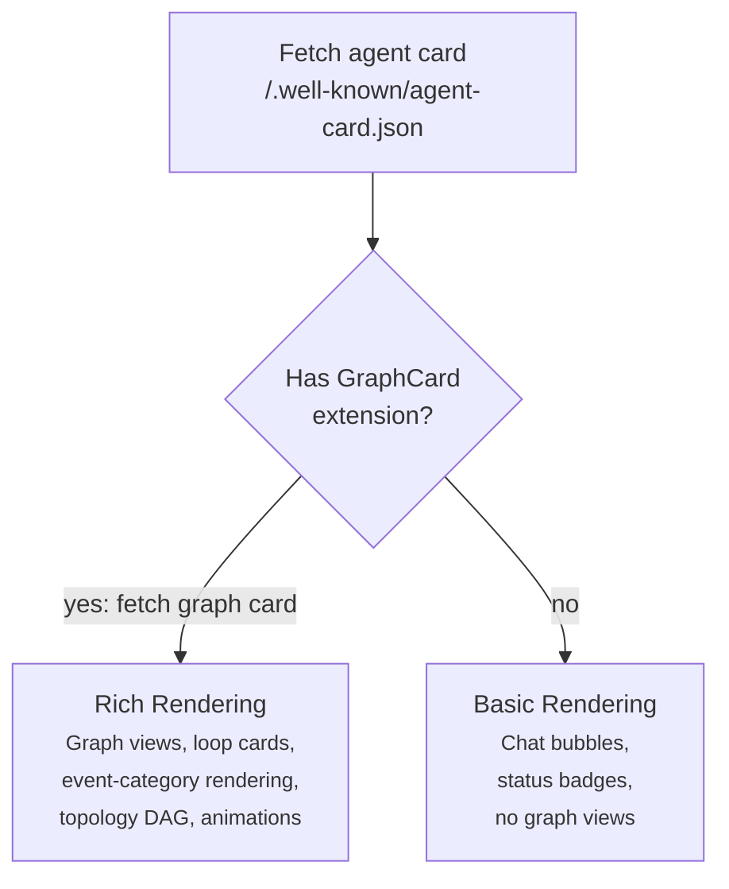
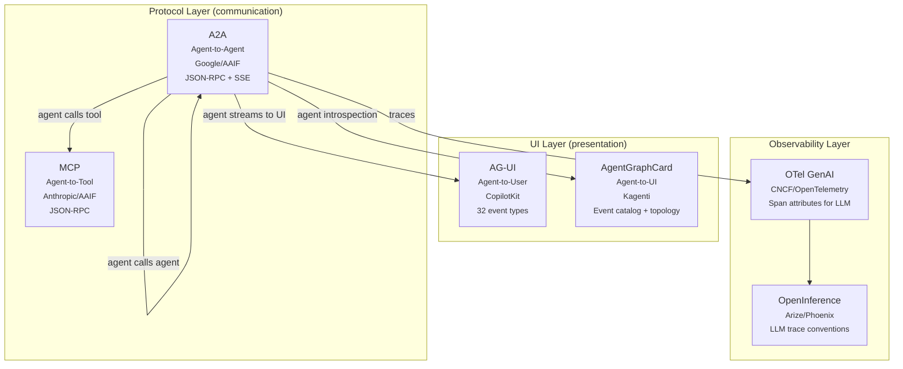
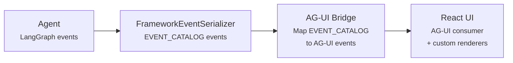
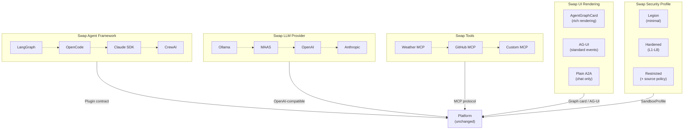

# Pluggable Architecture

The Agentic Runtime is designed around **pluggable layers** with explicit
contracts at each boundary. This enables swapping agent frameworks, security
profiles, LLM providers, tools, and even UI rendering — without changing
platform code.

---

## Pluggability Map



---

## Layer 1: Agent Framework

**Contract:** Two functions exported from any Python module.

```python
def get_agent_card(host: str, port: int) -> AgentCard
def build_executor(workspace_manager, permission_checker, sources_config) -> AgentExecutor
```

**Plug mechanism:** Set `AGENT_MODULE=my_framework.plugin` as env var.
The platform base image loads it via `importlib.import_module()` at startup.

**Implementations:**

| Framework | Module | Status |
|-----------|--------|--------|
| LangGraph | `sandbox_agent.graph` | Shipped |
| OpenCode | `opencode.plugin` | WIP |
| Claude Agent SDK | -- | Designed |
| CrewAI / AG2 / OpenHands | -- | Designed |

Adding a new framework means writing one Python file with two functions.
The platform handles everything else: A2A server, workspace, permissions,
auth, budget, observability.

## Layer 2: Event Serialization

**Contract:** `FrameworkEventSerializer` abstract base class.

```python
class FrameworkEventSerializer(ABC):
    @abstractmethod
    def serialize(self, key: str, value: dict) -> str: ...
```

Each framework adapter translates native events into EVENT_CATALOG format.
The UI renders events based on their `type` and `category` — it doesn't
need to know which framework produced them.

**This is the key to framework-neutral UI rendering.** A `tool_call` event
looks the same whether it came from LangGraph, OpenCode, or CrewAI.

## Layer 3: Composable Security

**Contract:** Boolean toggles assembled by `SandboxProfile`:

```python
profile = SandboxProfile(secctx=True, landlock=True, proxy=True)
manifest = profile.build_deployment(agent_name, namespace)
```

Each layer is independently toggleable:

| Toggle | What It Adds |
|--------|-------------|
| `secctx` | SecurityContext (non-root, drop ALL, read-only FS) |
| `landlock` | Landlock LSM init container + env var |
| `proxy` | Squid egress proxy sidecar + env vars |

Named profiles (`legion`, `basic`, `hardened`, `restricted`) are presets.
The wizard UI allows custom combinations.

## Layer 4: Task Store

**Contract:** A2A SDK `TaskStore` interface.

**Plug mechanism:** `TASK_STORE_DB_URL` env var. If set, uses PostgreSQL.
If absent, uses in-memory store.

```python
def create_task_store():
    db_url = os.environ.get("TASK_STORE_DB_URL", "")
    if db_url:
        return DatabaseTaskStore(create_async_engine(db_url))
    return InMemoryTaskStore()
```

## Layer 5: LLM Provider

**Contract:** OpenAI-compatible HTTP endpoint.

**Plug mechanism:** LiteLLM Proxy routes to 75+ providers. Agents point
`LLM_API_BASE` at the budget proxy, which forwards to LiteLLM.

Any provider that exposes `/v1/chat/completions` works: OpenAI, Anthropic,
vLLM, Ollama, MAAS, Azure, AWS Bedrock, Google Vertex.

## Layer 6: Tool System

**Contract:** MCP (Model Context Protocol) tool interface.

**Plug mechanism:** Kubernetes labels for discovery. MCP Gateway routes
tool calls. Agents call tools via single `/mcp` URL.

```yaml
labels:
  kagenti.io/type: tool
  kagenti.io/protocol: mcp
  kagenti.io/transport: streamable-http
```

Any HTTP service with MCP endpoints becomes a tool automatically.

## Layer 7: Identity

**Contract:** Keycloak OIDC + optional SPIFFE workload identity.

Two modes per agent pod (controlled by `kagenti.io/spire` label):
- `enabled` — SPIFFE identity via SPIRE, token exchange for service-to-service
- `disabled` — Static client ID (development fallback)

AuthBridge sidecar handles both transparently.

## Layer 8: Observability

**Contract:** OpenTelemetry SDK + configurable exporters.

Agents emit OTel traces. The collector routes to:
- Phoenix (LLM-specific trace visualization)
- MLflow (experiment tracking)
- Jaeger (distributed tracing)

Configuration via `OTEL_EXPORTER_OTLP_ENDPOINT`. Wrapped in try/except
so observability never breaks the agent.

## Layer 9: UI Rendering

**Contract:** Agent card + optional AgentGraphCard extension.

The UI adapts rendering based on what the agent declares:



**Graceful degradation:**
- No graph card → default topology, basic event rendering
- No event catalog → render all events as text
- No topology → no graph view tab (chat-only)

---

## Standards Landscape

The AI agent ecosystem has several complementary standards. Kagenti uses
A2A and MCP as core protocols, with AgentGraphCard as our own extension.
Other standards map to potential future integration.



### Standard Comparison

| Standard | What It Defines | Kagenti Use | Status |
|----------|----------------|-------------|--------|
| **A2A** | Agent-to-agent communication | Core protocol (agent server + backend calls) | Active |
| **MCP** | Agent-to-tool interface | MCP Gateway for tool discovery + routing | Active |
| **AgentGraphCard** | Event schema + graph topology | UI rendering contract for instrumented agents | Shipped |
| **AG-UI** | Agent-to-user UI events | Potential UI plugin standard (32 event types, A2A bridge) | Evaluate |
| **OTel GenAI** | LLM observability attributes | Token counts, model info, latency in traces | Active |
| **OpenInference** | LLM trace conventions | Phoenix trace rendering (graph.node attributes) | Active |

### AG-UI — Potential UI Plugin Standard

[AG-UI](https://docs.ag-ui.com/) defines 32 typed events for agent-to-user
communication. It already has an [A2A bridge](https://github.com/ag-ui-protocol/ag-ui/tree/main/integrations/a2a)
that converts A2A events to AG-UI events.

**Relevant event categories:**

| AG-UI Category | Events | Maps to Our |
|---------------|--------|-------------|
| Lifecycle | RUN_STARTED, RUN_FINISHED, RUN_ERROR | meta (node_transition) |
| Text Messages | TEXT_MESSAGE_START/CONTENT/END | reasoning (planner_output, thinking) |
| Tool Calls | TOOL_CALL_START/ARGS/END/RESULT | execution + tool_output |
| State | STATE_SNAPSHOT, STATE_DELTA | meta (budget_update) |
| Reasoning | REASONING_START/CONTENT/END | reasoning (micro_reasoning) |
| Custom | CUSTOM, RAW | Any EVENT_CATALOG type |

**How it would work with Kagenti:**



Our `EVENT_CATALOG` events would map to AG-UI events:
- `planner_output` → `TEXT_MESSAGE_START` + `TEXT_MESSAGE_CONTENT` + `TEXT_MESSAGE_END`
- `tool_call` → `TOOL_CALL_START` + `TOOL_CALL_ARGS` + `TOOL_CALL_END`
- `tool_result` → `TOOL_CALL_RESULT`
- `budget_update` → `STATE_DELTA`
- Agent-specific events → `CUSTOM` (name: event type, value: payload)

**Benefit:** Any AG-UI compatible frontend (CopilotKit, custom React apps)
could render Kagenti agent sessions out of the box. External UIs wouldn't
need to understand our EVENT_CATALOG directly — they'd consume standard
AG-UI events.

**Trade-off:** AG-UI's 32 event types are simpler than our 12-type
EVENT_CATALOG with 7 categories. We'd lose some granularity in the
standard mapping (reflector_decision, micro_reasoning have no AG-UI
equivalent). The `CUSTOM` event type is the escape hatch for rich
rendering.

### MCP Tool Metadata for UI

MCP tool definitions include UI-relevant metadata:

```json
{
  "name": "shell",
  "title": "Shell Command",
  "description": "Execute shell commands in workspace",
  "inputSchema": { "type": "object", "properties": {"command": {"type": "string"}} },
  "annotations": {
    "destructiveHint": true,
    "readOnlyHint": false,
    "openWorldHint": true
  }
}
```

The `annotations` field drives UI decisions:
- `destructiveHint: true` → show confirmation dialog
- `readOnlyHint: true` → skip HITL approval
- `openWorldHint: true` → show network access badge

### OTel GenAI for Observability UI

OTel GenAI semantic conventions provide standard attributes for dashboards:

| Attribute | UI Component |
|-----------|-------------|
| `gen_ai.request.model` | Model badge |
| `gen_ai.usage.input_tokens` | Token counter |
| `gen_ai.usage.output_tokens` | Token counter |
| `gen_ai.operation.name` | Step label |
| `gen_ai.agent.name` | Agent badge |

These attributes power the LLM Analytics tab and budget displays
without inventing custom schemas.

---

## The Plugin Vision

The pluggable architecture creates a **contract-driven stack** where
each layer can be swapped independently:



Each arrow represents a **contract boundary**. As long as the contract
is satisfied, any implementation works. The platform doesn't need to
know what's behind the contract.

**Key principle:** The platform provides the infrastructure contracts.
Agents provide business logic. UI provides rendering. Each can evolve
independently.
