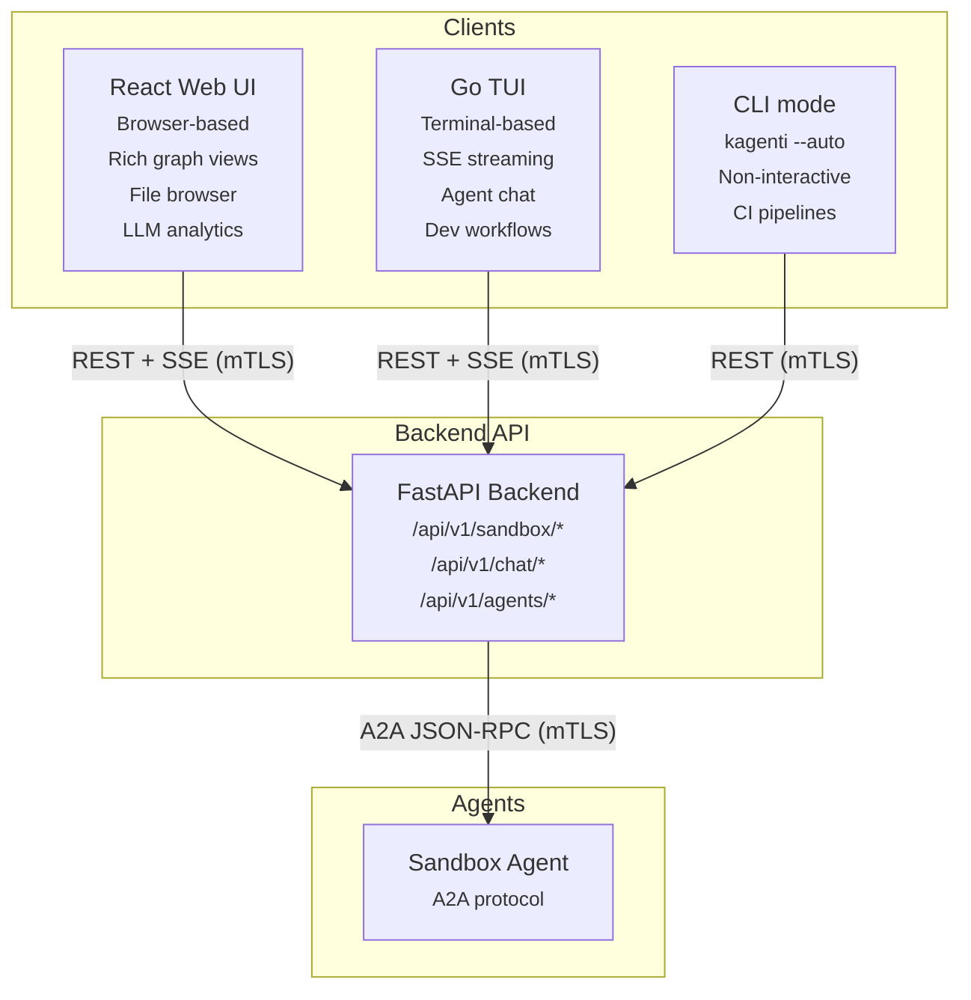
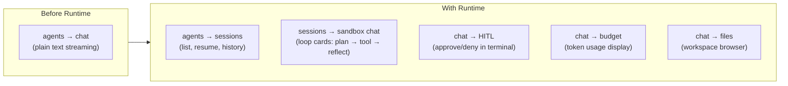
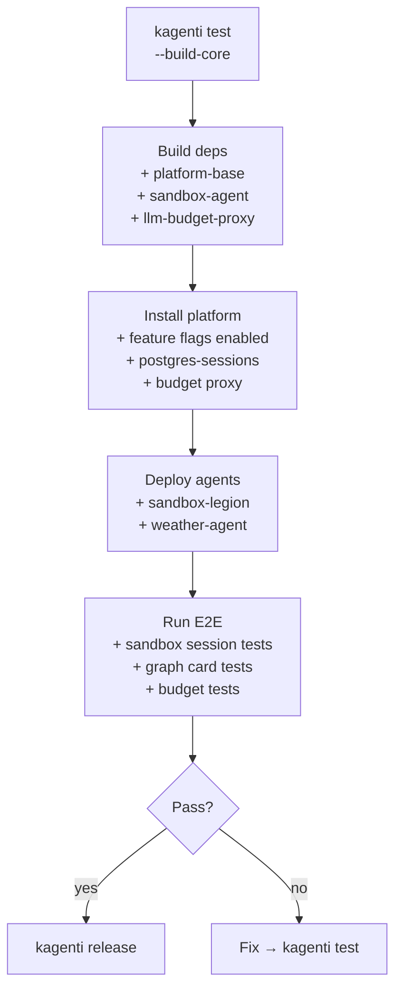

# TUI Integration

The Kagenti TUI (`kagenti` binary) is a Go/Bubbletea terminal client that
provides the same agent interaction capabilities as the React UI, plus
developer workflows (cluster management, testing, releases) that don't
exist in the web UI.

---

## Two Clients, Same Backend



Both clients consume the same API. The Agentic Runtime features
(sessions, events, budget, HITL) work identically in both.

---

## TUI Command Map

The TUI serves three modes:

```
kagenti                             # Interactive TUI (Bubbletea)
kagenti <command>                   # CLI mode (non-interactive)
kagenti <command> --auto            # CI mode (no prompts)
```

### Production Commands (API-only)

These use the backend HTTP API, same as the web UI:

| Command | What It Does | Runtime Feature |
|---------|-------------|-----------------|
| `kagenti agents` | List agents in namespace | Agent discovery |
| `kagenti chat` | SSE streaming chat session | Sessions, events, HITL |
| `kagenti deploy agent` | Deploy agent via wizard | Import wizard |
| `kagenti login` | OAuth device code flow | Keycloak auth |
| `kagenti status` | Platform health dashboard | -- |
| `kagenti teams` | List/create/delete namespaces | Team provisioning |

### Developer Commands (Shell + API)

These shell out to scripts and tools (not API-only):

| Command | What It Does |
|---------|-------------|
| `kagenti cluster create` | Create Kind/HyperShift cluster + deploy platform |
| `kagenti cluster destroy` | Tear down cluster |
| `kagenti test` | Full E2E with dependency overrides |
| `kagenti run <phase>` | Re-run individual test phase |
| `kagenti release` | Multi-repo tag + wait CI + bump chart |

---

## Agentic Runtime in the TUI

The TUI expands from basic text chat to full sandbox session management:



### SSE Streaming in Terminal

The TUI already implements SSE streaming for agent chat via Bubbletea's
message-based architecture. Each SSE line becomes a Bubbletea `Msg`:

```
Agent event stream → readNextLine() Cmd → Bubbletea Update → Render
```

This same pattern extends to Agentic Runtime events:

| EVENT_CATALOG Type | TUI Rendering |
|-------------------|---------------|
| `planner_output` | Indented plan steps with step numbers |
| `tool_call` | `[tool] shell: ls -la` with syntax highlighting |
| `tool_result` | Truncated output with `[+]` expand toggle |
| `reflector_decision` | Status line: `[reflect] continue (step 2/5)` |
| `reporter_output` | Final answer in markdown (glamour renderer) |
| `budget_update` | Status bar: `tokens: 45k/1M` |
| `hitl_request` | Prompt: `[A]pprove / [D]eny: shell rm -rf /tmp/*` |

### HITL in Terminal

HITL gates work naturally in terminal mode:

```
⚠ Agent requests approval:
  Tool: shell
  Args: rm -rf /tmp/old_workspace
  Risk: destructive

  [a] Approve  [d] Deny  [i] Inspect args
```

In `--auto` mode, HITL gates auto-deny by default (configurable).

### Graph Card in TUI

The TUI can fetch the AgentGraphCard and render a simplified topology:

```
Graph: router → planner → executor → reflector → reporter
                    ↑          │
                    └──────────┘ (replan)

Active: executor [step 2/5] ●
```

Full graph visualization is better suited to the web UI. The TUI focuses
on text-based step tracking and status indicators.

---

## CI Integration

The same `kagenti` binary runs in GitHub Actions with `--auto` flags:

```yaml
# Single-step mode
- name: Deploy & Test
  run: kagenti test --auto --platform kind --build-core

# Or individual phases (visible in GitHub Actions UI)
- name: Create cluster
  run: kagenti cluster create --platform kind
- name: Install platform
  run: kagenti run install
- name: Build deps
  run: kagenti run build-deps --build-core
- name: Run E2E
  run: kagenti run e2e
```

State flows between steps via `$GITHUB_ENV`. The `kagenti` binary
detects CI mode and writes structured output to `$GITHUB_STEP_SUMMARY`.

---

## Developer Workflow with Runtime

The `kagenti test` command now includes Agentic Runtime components:



### Team Provisioning with Runtime

`kagenti team create` provisions a full namespace with runtime components:

```
$ kagenti team create my-team

Creating namespace: my-team
  ✅ Namespace created
  ✅ Istio Ambient labels applied
  ✅ AuthBridge config (envoy-config, authbridge-config)
  ✅ PostgreSQL StatefulSet (sessions + llm_budget)
  ✅ LLM Budget Proxy
  ✅ RBAC bindings
  ✅ Secrets (postgres, litellm)
  ⏳ Waiting for postgres-sessions ready...
  ✅ Team my-team ready

Use: kagenti --ns my-team agents
```
